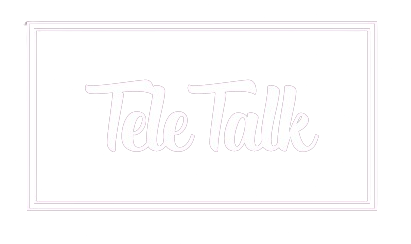

# TeleTalk - The Morse Code Chat Platform

## Introduction

Welcome to TeleTalk, a revolutionary chat platform that brings a unique twist to digital communication. Say goodbye to the conventional typing and embrace the world of Morse code! TeleTalk is not just a chat app; it's a new way to connect, combining the simplicity of Morse code with modern chat functionalities.

## Features

- **Morse Code Input System:** At the heart of TeleTalk is our innovative Morse code input system. This intuitive and user-friendly method makes typing a breeze. Whether you're a Morse code expert or a beginner, you'll find communicating via Morse code surprisingly efficient and fun! Trust me! Its not even how real morse code works!

- **Global Group Chat:** Connect with people around the world in our global group chat. Share ideas, make new friends, or just have a good time chatting in a unique and engaging way.

- **Unlimited Direct Messages:** Enjoy private conversations with as many users as you like. TeleTalk's direct messaging feature ensures your private chats stay just that - private and secure - well, not really secure but what app is really secure right?

## Getting Started

Access TeleTalk easily by visiting [https://teletalkdev.netlify.app/](https://teletalkdev.netlify.app/). The platform is web-based, meaning no downloads or installations are necessary. Just open the link and start chatting!

## User-Friendly Design

TeleTalk prides itself on its user-friendly design. Morse code may seem daunting at first, but you'll soon discover its daunting. The platform is designed to be intuitive, making the transition to Morse code input smooth and straightforward.

## Why Morse Code?

Morse code is not just a piece of communication history; it's a highly efficient way to convey messages. It's simple, fast, and can be used in various contexts. By bringing Morse code to chat, TeleTalk offers a unique and engaging experience that sets it apart from traditional chat applications.

## Contribute

We welcome contributions to TeleTalk! If you're interested in contributing, please visit our GitHub repository. We appreciate any input that helps improve and grow TeleTalk.

## Connect with Us

If you have any questions, suggestions, or just want to chat, feel free to reach out. We're always happy to hear from our users and the community.

## Acknowledgements

Special thanks to me who has contributed to making TeleTalk a reality. My support and feedback is amazing.

---

TeleTalk - Reimagining communication, one dot and dash at a time.

Hint: this is a fun project and should be treated as that!
